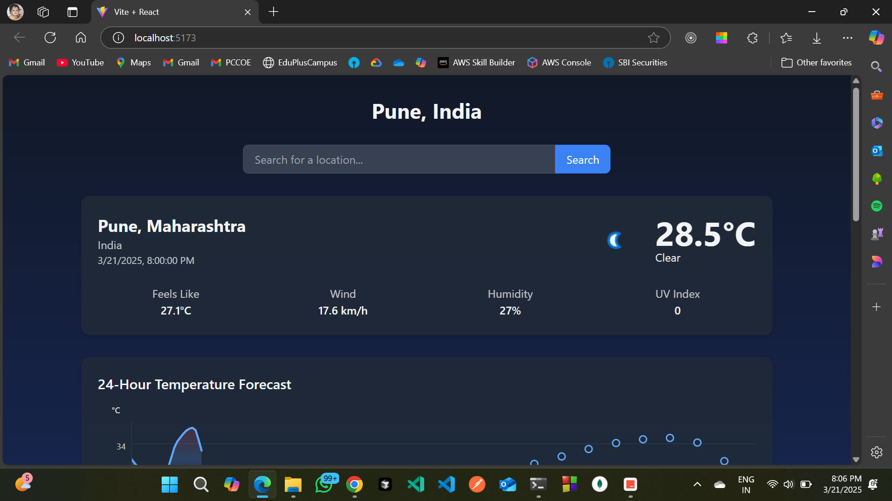

# Weather Dashboard

A modern, responsive weather dashboard built with React and Tailwind CSS that provides detailed weather information with a beautiful UI that adapts to the time of day.



## Features

- **Real-time Weather Data**: Displays current weather conditions including temperature, humidity, wind speed, and more
- **Dynamic Theming**: UI colors adapt based on the time of day at the searched location
- **Detailed Weather Cards**: Individual cards for various weather metrics:
  - Temperature (current, feels like, min/max)
  - UV Index with risk level indicators
  - Humidity with comfort level
  - Wind speed and direction with visual compass
  - Air Quality Index (AQI) with health recommendations
  - Precipitation data and forecast
  - Atmospheric pressure
  - Visibility conditions
  - Sunrise and sunset times with visual indicator
- **24-Hour Forecast Chart**: Visual representation of temperature changes over the next 24 hours
- **Responsive Design**: Optimized for all device sizes from mobile to desktop
- **Location Search**: Search for weather data from any location worldwide

## Technologies Used

- **React**: Frontend library for building the user interface
- **Tailwind CSS**: Utility-first CSS framework for styling
- **WeatherAPI**: Data source for accurate weather information
- **Vite**: Build tool and development server

## Getting Started

### Prerequisites

- Node.js (v14 or later)
- npm or yarn

### Installation

1. Clone the repository:
   ```bash
   git clone https://github.com/om-dalvi-1904/weather-app.git
   cd weather-app
   ```
